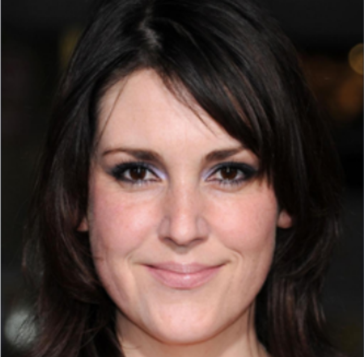

# Image Restoration by Denoising Diffusion Models with Iteratively Preconditioned Guidance (DDPG)

**Project Seminar: Reproduce Research Results — FAU Erlangen-Nürnberg**

> This repository documents a reproduction of selected results from a published research paper, completed as part of the Project Seminar: Reproduce Research Results at FAU Erlangen-Nürnberg. **This is reproduction work, not original research.** All credit for the original method, code, and results belongs to the paper's authors.

## Paper

- **Title:** Image Restoration by Denoising Diffusion Models with Iteratively Preconditioned Guidance
- **Venue:** CVPR 2024
- **Paper link:** https://openaccess.thecvf.com/content/CVPR2024/html/Garber_Image_Restoration_by_Denoising_Diffusion_Models_with_Iteratively_Preconditioned_Guidance_CVPR_2024_paper.html
- **Original code repository:** https://github.com/tirer-lab/DDPG

## About This Project

This project reproduces the deblurring and super-resolution experiments reported in **Table 4** of the paper (PSNR / LPIPS results on CelebA-HQ 1K), comparing the paper's reported numbers for the proposed DDPG method against numbers obtained by independently running the authors' released code.

The goal, per the seminar's purpose, is to verify the paper's reported results through independent reproduction and to practice the end-to-end reproduction workflow (environment setup, running the original implementation, and result comparison) — not to propose a new method or extend the original work.

## Setup & Run Instructions

All steps below are taken from the project report and reflect exactly what was run.

### 1. Clone the original repository

```bash
git clone https://github.com/tirer-lab/DDPG.git
cd DDPG
```

### 2. Set up a Python virtual environment

```bash
python3 -m venv ddpg_env
source ddpg_env/bin/activate
```

### 3. Install dependencies

> **Note (documented dependency conflict):** the original requirements have a version mismatch — `torchvision==0.10.1+cu111` requires `torch==1.9.1+cu111`, but the original instructions specify `torch==1.9.0+cu111`. We installed `torch==1.9.1+cu111` to match `torchvision`.

```bash
pip install torch==1.9.1+cu111 torchvision==0.10.1+cu111 -f https://download.pytorch.org/whl/torch_stable.html
pip install lpips numpy tqdm pillow pyYaml pandas scipy
```

Additional dependency:

```bash
pip install tensorboard
```

### 4. Download pretrained checkpoints

| Dataset | Checkpoint destination |
|---|---|
| CelebA-HQ | `DDPG/exp/logs/celeba/` |
| ImageNet | `DDPG/exp/logs/imagenet/` |

Checkpoint download links are provided in the [original DDPG repository's README](https://github.com/tirer-lab/DDPG).

### 5. Motion deblur kernels

Motion blur kernels were generated using the [motionblur](https://github.com/LeviBorodenko/motionblur) repository. Clone that repository and copy `motionblur.py` into `DDPG/functions`.

As specified in the paper, motion deblur kernels were generated with **intensity = 0.5**.

### 6. Example run commands

The project report documents the following two example commands:

**CelebA noiseless SRx4:**

```bash
python main.py --config celeba_hq.yml --path_y celeba_hq --deg sr_bicubic --sigma_y 0 \
-i DDPG_celeba_sr_bicubic_sigma_y_0 --inject_noise 1 --zeta 0.7 --step_size_mode 0 \
--deg_scale 4 --operator_imp SVD
```

**CelebA Gaussian deblurring, σ_y = 0.05:**

```bash
python main.py --config celeba_hq.yml --path_y celeba_hq --deg deblur_gauss --sigma_y 0.05 \
-i DDPG_celeba_deblur_gauss_sigma_y_0.05 --inject_noise 1 --gamma 8 --zeta 0.5 --eta_tilde 0.7 \
--step_size_mode 1 --operator_imp FFT
```

> **Gap in source materials:** the report's results cover additional configurations (other `--sigma_y` values, and motion deblurring) beyond the two commands shown above, but the exact commands used for those runs are not included in the provided report. They are omitted here rather than reconstructed, to avoid misrepresenting the actual commands used. *(If a notebook documenting these runs becomes available, this section should be updated with the verbatim commands.)*

## Results

### Comparison: paper-reported vs. reproduced (DDPG method)

The paper's numbers in Table 4 are averaged over the CelebA-HQ 1K test set. Our reproduced numbers below are for a **single representative sample (`0_0.png`)**, as noted in the project report — full results across all test images were intended for separate final submission and are not included in this report.

| Task | Paper (DDPG, Table 4) PSNR / LPIPS | Reproduced (single sample) PSNR / LPIPS |
|---|---|---|
| Bicubic SRx4, σ_e = 0 | 31.60 / 0.052 | 34.45 / 0.0552 |
| Bicubic SRx4, σ_e = 0.05 | 29.39 / 0.105 | 31.33 / 0.1065 |
| Gaussian deblur, σ_e = 0 | 45.46 / 0.002 | 49.32 / 0.0011 |
| Gaussian deblur, σ_e = 0.05 | 30.41 / 0.068 | 33.30 / 0.0646 |
| Gaussian deblur, σ_e = 0.1 | 29.18 / 0.080 | 31.76 / 0.0959 |
| Motion deblur, σ_e = 0.05 | 29.02 / 0.082 | 30.83 / 0.0852 |
| Motion deblur, σ_e = 0.1 | 27.74 / 0.099 | 29.45 / 0.1083 |

### Additional reproduced configurations (not present in paper's Table 4)

The report also includes runs at σ_y = 0.01 for each degradation type, which Table 4 does not report, so there is no paper value to compare against directly:

| Run | PSNR (dB) | LPIPS |
|---|---|---|
| Gaussian deblur, σ_y = 0.01 | 34.90 | 0.0451 |
| Motion deblur, σ_y = 0.01 | 34.16 | 0.0480 |
| SR bicubic, σ_y = 0.01 | 34.43 | 0.0956 |

## Notes & Challenges

- **Dependency version conflict:** `torchvision==0.10.1+cu111` requires `torch==1.9.1+cu111`; the originally specified `torch==1.9.0+cu111` does not satisfy this and had to be upgraded (see Setup, step 3).
- No other environment or implementation issues are documented in the project report.

## Sample Image



*Caption: CelebA-HQ degraded input sample (`0_0.png`) used for the deblurring/super-resolution runs above. No restored/output image was included in the source report — add one here if available.*

## Acknowledgements

This repository documents a reproduction exercise only and makes **no original research claim**. All credit for the method, theoretical contributions, and original implementation belongs to:

- The authors of the original paper, *Image Restoration by Denoising Diffusion Models with Iteratively Preconditioned Guidance* (Garber et al., CVPR 2024).
- The maintainers of the original code repository: [tirer-lab/DDPG](https://github.com/tirer-lab/DDPG).
- The maintainers of [motionblur](https://github.com/LeviBorodenko/motionblur), used for motion deblur kernel generation.

This work was completed as part of the **Project Seminar: Reproduce Research Results**, Friedrich-Alexander-Universität Erlangen-Nürnberg.
